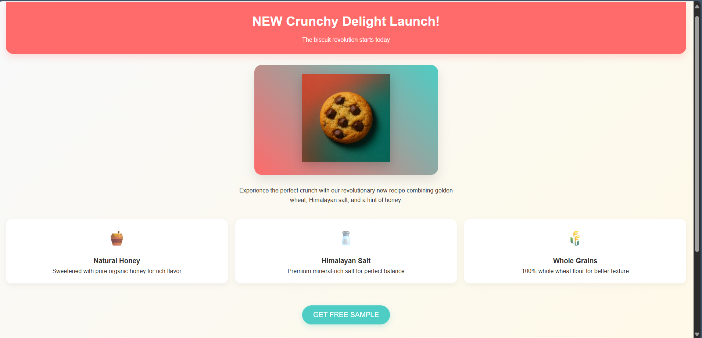

# ESP8266-Billboard
What if you could turn a $3 ESP8266 into a free billboard? No router needed—just broadcast a custom WiFi name (SSID) with your ad message!

# 🍪 WiFi Ad Broadcast – Zero-Cost Marketing Idea

A simple and creative way for small businesses to advertise **with zero cost** using WiFi SSIDs!

## 🚀 Concept

Broadcast your **WiFi network name (SSID)** as a mini advertisement.

Example:

## 📸 Example Visual

## 💡 How to Use

1. Go to your **WiFi router settings**.
2. Locate the **SSID (network name)** field.
3. Replace it with a **short, catchy message**:
   - `TryOurCookies 🍪`
   - `FreeMuffin@Counter3`
   - `ShopLocalSaveMore`
4. Save settings and reboot your router if needed.

## 🎯 Why This Works

- Cost: $0 (you’re using your existing WiFi)
- Visibility: People search for WiFi everywhere
- Curiosity: Catchy names attract attention
- Perfect for: Cafes, kiosks, food trucks, pop-ups, events

## 📋 Notes

- **Keep it short** – SSID limit is ~32 characters.
- Make sure the message is **family-friendly**.
- Works best in areas with **foot traffic**.

## 📎 Use Cases

| Location       | Example SSID               |
|----------------|----------------------------|
| Coffee Shop    | ☕ FreeLatteToday Only!     |
| Cookie Stand   | 🍪 HotCookiesNow - Ask Staff |
| Barber Shop    | ✂️ FadeFriday - 30% Off     |
| Bookstore      | 📚 NewArrivalShelf →        |

## 📦 Files Included

- `cookie_ad.png` – Visual example for LinkedIn or Instagram
- `README.md` – This file

## 📣 License

Creative Commons – Feel free to use and adapt with credit.

---

Let me know if you'd like this README bundled in a ZIP with the image or if you'd like a live GitHub repo starter.

